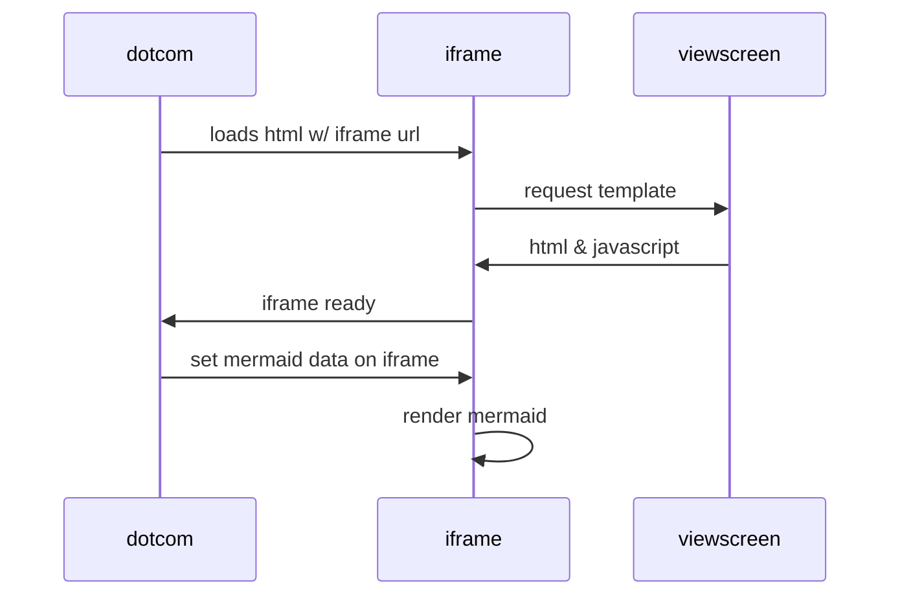

## Copilot Chat Demo

Not much to see here - just some snippets of code that I use when doing demos of the 
Chat functionality in [GitHub Copilot](https://gh.io/copilotx)

### Prompts

#### parse_expenses.py
Propose a fix for the bugs in my code.
Write a set of unit test functions for the selected code

### HTML Rendering Pipeline

#### Questions
How does variable visibility work in python?
Would you rather fight 1 horse sized duck, or 100 duck sized horses?

#### Copilot 4 Docs
What is a PR and how do I use them?
